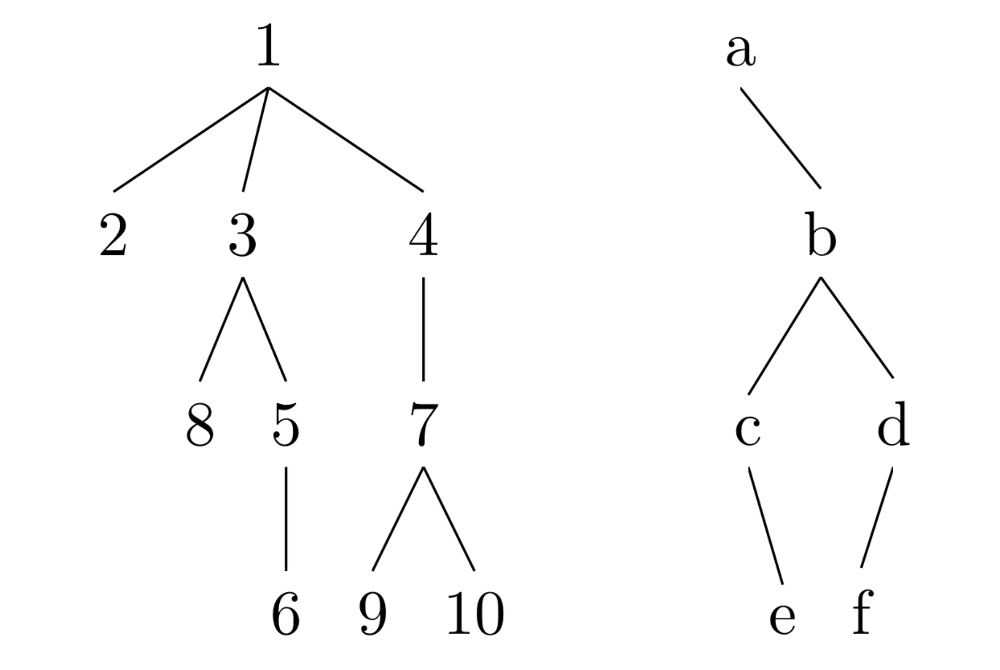

## Problem Statement

Consider the following two trees:



For each of them, indicate what type of tree it is and write down the sequence of nodes resulting from the preorder, postorder, inorder, and breadth-first traversals. If any traversal couldn't be performed, provide a justification.

## Solution

### Tree 1
- Type: N-ary tree (or generic tree) is an arboreal data structure where each node has no more than N children nodes.

  - Preorder: 1, 2, 3, 8, 5, 6, 4, 7, 9, 10 
  - Pseudocode:
  
    ````
    Reverse pre-order, NRL Visit the current node.
    Recursively traverse the current node's right subtree.
    Recursively traverse the current node's left subtree.
    ````